# ACTIVIDAD 6 JIRA BACKLOG

## CREACION EPICA

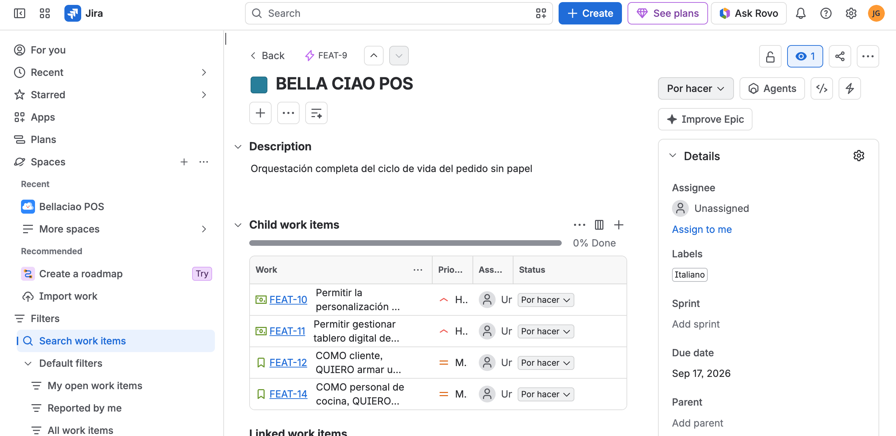

## CREACION FEATURES

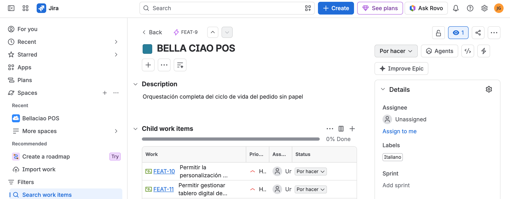

## HISTORIAS DE USO 

## 1

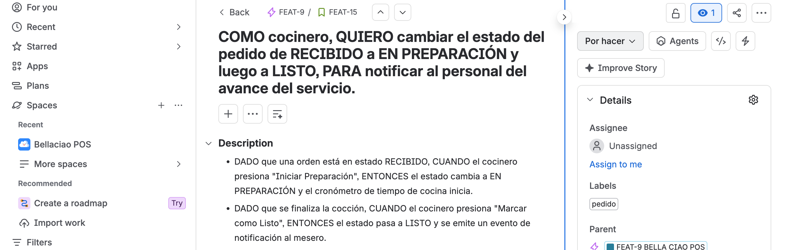

## 2

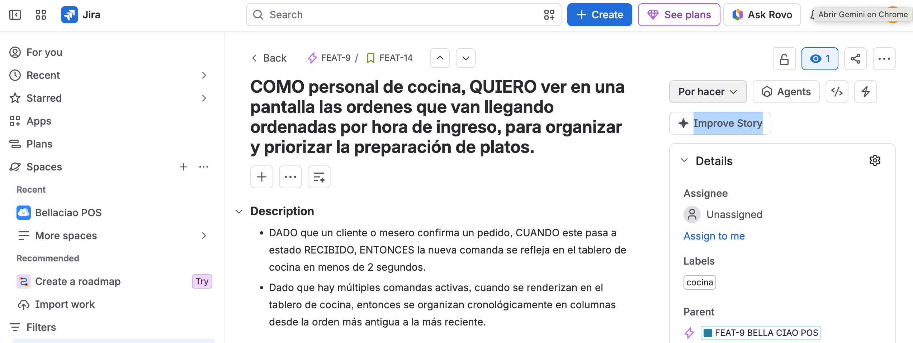

## 3

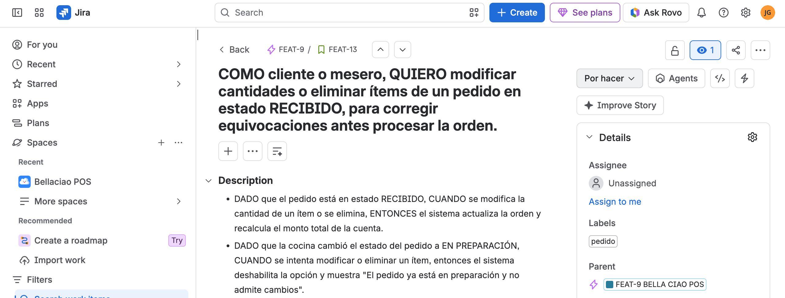

## 4

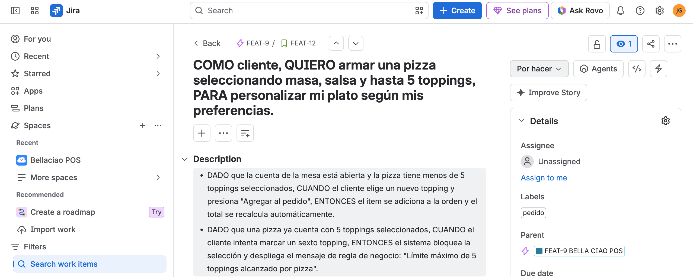

## FEATURE CON HISTORIA

FEATURE 1

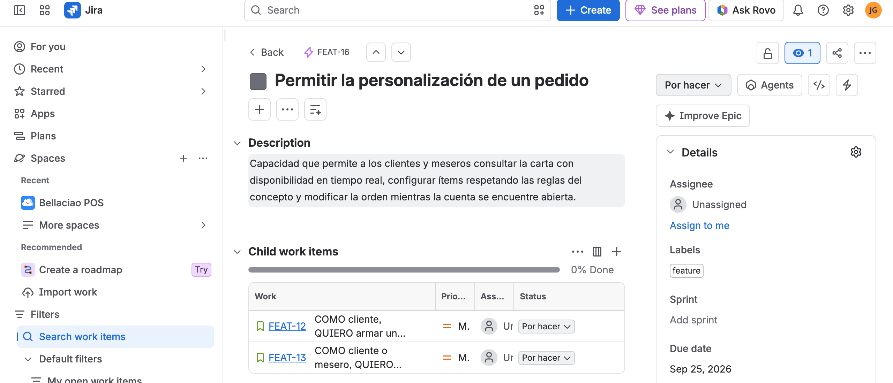

FEATURE 2

## SUBTAREAS

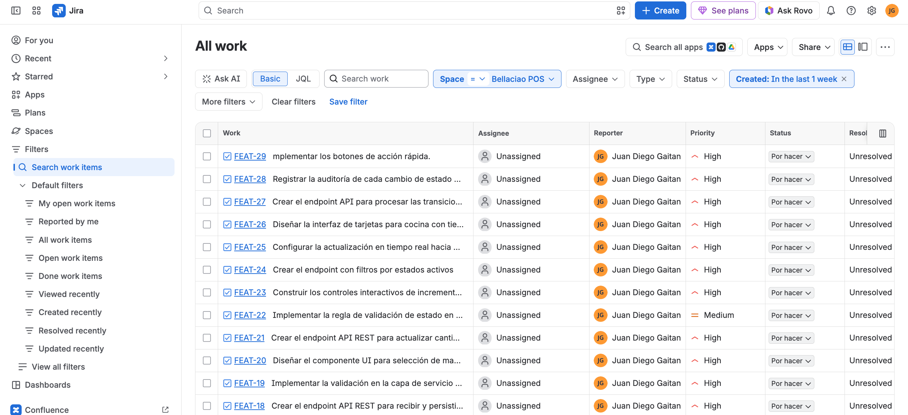

## ASIGNAR PRIORIDADES

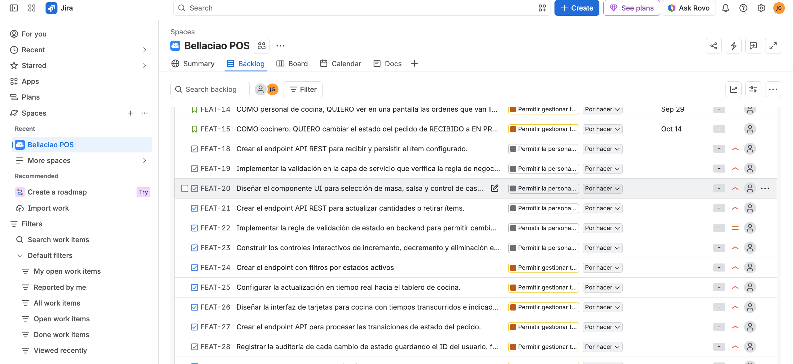

## TIMELINE

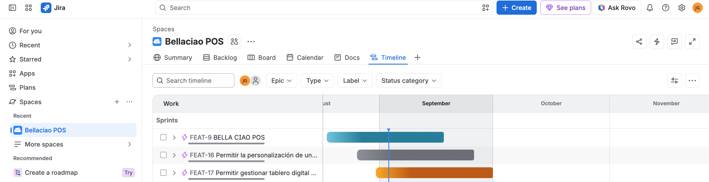

# SPRING 1

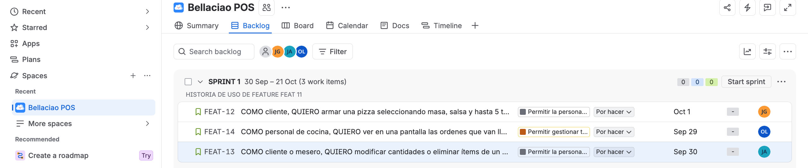

# JUSTIFICACION

-Se decidio asignar las 4 historias de uso en el primer Spring pues su prioridad es Alta y es necesario desarollarlas para poder continuar con las demas tareas y siguiente Feature. Ademas son historias de uso sin muchas restricciones y pocas tareas. Se da un tiempo estimado correcto y se distribuye la carga entre e equipo adecuadamente.
