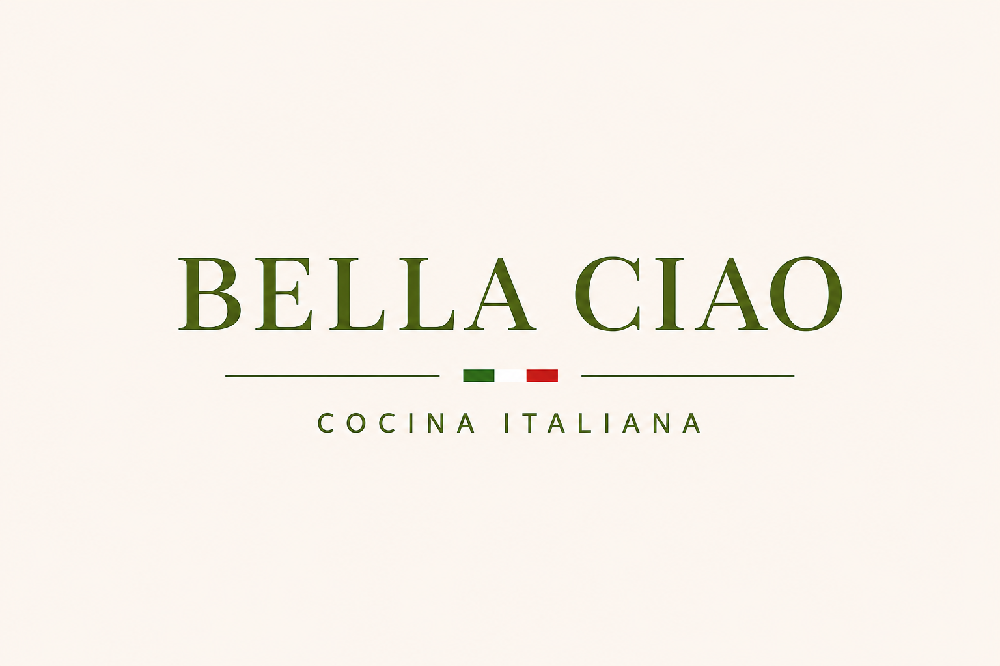
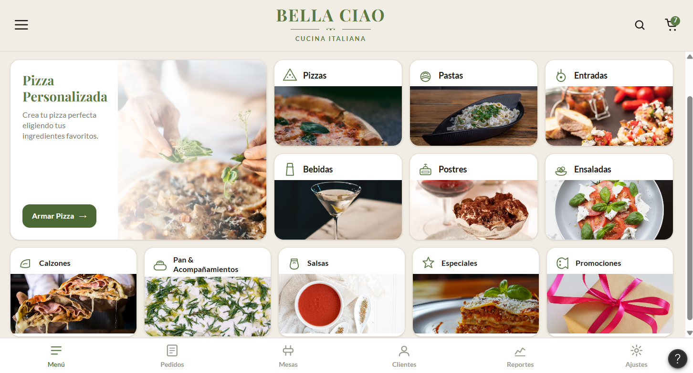
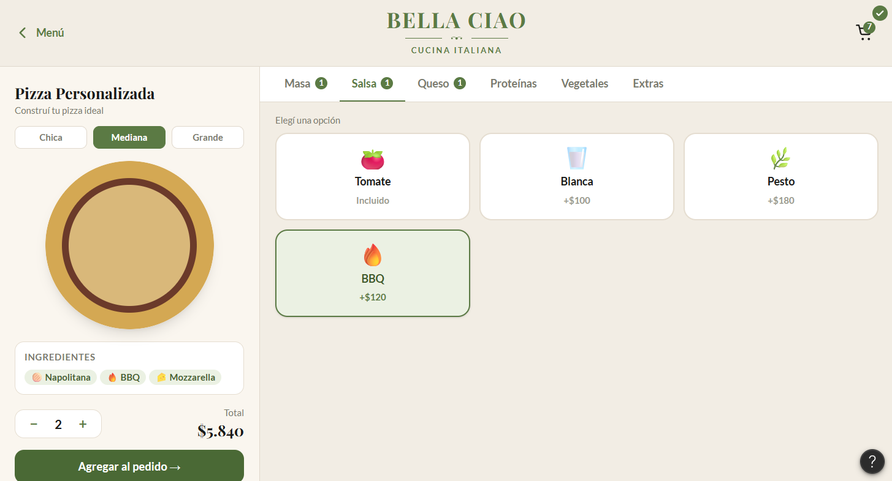
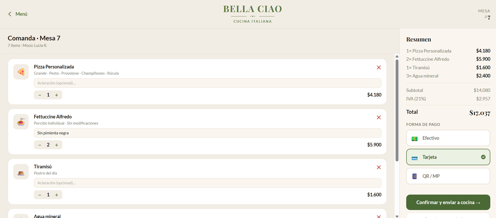
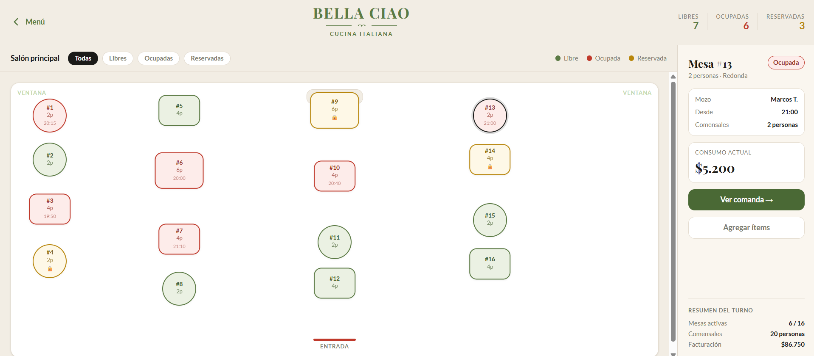
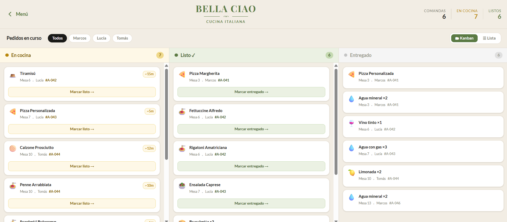

# Análisis de Requerimientos - Sistema Restaurante Italiano

## 03. Listado de Requerimientos Funcionales y No Funcionales

### Requerimientos Funcionales (RF)
* **RF1:** Consultar la carta con el estado de disponibilidad de cada plato.
* **RF2:** Agregar, modificar y quitar ítems de un pedido con la cuenta abierta.
* **RF3:** Confirmar un pedido y enviarlo automáticamente al tablero de cocina.
* **RF4:** Cambiar el estado de un pedido desde cocina (RECIBIDO $\rightarrow$ EN PREPARACIÓN $\rightarrow$ LISTO $\rightarrow$ ENTREGADO).
* **RF5:** Cerrar la cuenta de una mesa y registrar el pago.
* **RF6:** Generar el reporte de ventas del día por plato y por mesero.
* **RF7 (Propio - Concepto Italiano):** Validar que una pizza o pasta personalizada no exceda el límite máximo de toppings.
* **RF8 (Propio - Reglas del negocio):** Congelar el precio de un plato en el sistema en el instante exacto en que se agrega al pedido, ignorando modificaciones de precio posteriores en la carta.
* **RF9 (Gestión de Carta):** Permitir al administrador desactivar un plato del menú sin borrar ni alterar su historial de ventas previo.
* **RF10 (Control de Mesas):** Restringir la apertura de cuentas, garantizando que una mesa solo pueda tener una cuenta activa a la vez y exigiendo el registro del pago para liberarla.
* **RF11 (Bloqueo de Inventario):** Marcar un plato como no disponible de forma automática en la carta digital en el instante en que el administrador o el sistema reporte el agotamiento de uno de sus ingredientes.

### Requerimientos No Funcionales (RNF)
* **RNF1 (Seguridad):** Control de acceso por rol (cliente, mesero, cocina, administrador).
* **RNF2 (Rendimiento):** El tablero de cocina refleja un pedido nuevo en menos de 2 segundos.
* **RNF3 (Disponibilidad):** El sistema opera durante todo el servicio sin reinicios (12 horas continuas).
* **RNF4 (Usabilidad):** Un cliente nuevo completa su primer pedido en máximo 4 pantallas.
* **RNF5 (Auditabilidad):** Todo cambio de estado de un pedido queda registrado con usuario y hora.
* **RNF6 (Compatibilidad - Propio):** La estructura del backend debe configurarse para compilar y ejecutarse estrictamente sobre entornos con Java 21, garantizando la base arquitectónica de la futura API.
* **RNF7 (Mantenibilidad - Propio):** La lógica de validación de los pedidos y límites de ingredientes debe estar respaldada por suites de verificación automatizada construidas sobre JUnit 5.
* **RNF8 (Accesibilidad Visual):** La interfaz de la plataforma web debe aplicar un contraste mínimo de 4.5:1 y asegurar que ningún dato o estado se transmita exclusivamente a través del color.
* **RNF9 (Persistencia y Recuperación):** El estado del pedido en curso debe persistir de manera segura en el sistema, evitando la pérdida de la información si el usuario cierra la sesión accidentalmente.
* **RNF10 (Integridad Transaccional):** Las operaciones de confirmación de un pedido y la lectura del inventario disponible deben ejecutarse garantizando la concurrencia de datos, previniendo que dos clientes agreguen el último ingrediente en stock al mismo tiempo.

---

## 04. Elaborar diagramas UML de casos de uso

---

---

---

## 05. Detallar los 3 requerimientos seleccionados

### BCR-02: Agregar, modificar y quitar ítems de un pedido
* **Descripción detallada:** Permitir al cliente armar/eliminar un plato, actualizando la cuenta de la mesa. En la sección de menú, el cliente selecciona el plato o se seleccionan las especificaciones del plato para personalizar. Están distribuidos en un grid donde se ve la imagen y una descripción como precio e ingredientes. Se agregan al carrito de compras al finalizar de seleccionar.
* **Actores involucrados:** Cliente / Mesero.
* **Precondiciones:** El cliente debe estar autenticado, tener una cuenta abierta y el plato debe estar disponible.

**Datos de Entrada**
| Nombre | Descripción | Tipo de campo | Reglas / Aplicación | Obligatorio |
| :--- | :--- | :--- | :--- | :--- |
| **valorPedido** | Valor total del ítem | Double | Calculado sumando base + toppings. Definitivo una vez finalizado | Sí |
| **estadoPedido** | Estado inicial de la orden | String | Fase en la que ingresa el plato a la cuenta antes de enviarse a cocina | Sí |

**Datos de Salida**
| Nombre | Descripción | Tipo de campo | Reglas / Aplicación | Obligatorio |
| :--- | :--- | :--- | :--- | :--- |
| **valorPedido** | Valor total del ítem | Double | Calculado sumando base + toppings. Definitivo una vez finalizado | Sí |
| **estadoPedido** | Estado inicial de la orden | String | Fase en la que ingresa el plato a la cuenta antes de enviarse a cocina | Sí |

**Flujos**
| Tipo | Paso | Actor | Descripción | Excepciones |
| :--- | :--- | :--- | :--- | :--- |
| Básico | 1 | Cliente | Selecciona el plato en el menú | FA-1 |
| Básico | 2 | Cliente | Selecciona salsa y masa del plato | FA-2 |
| Básico | 3 | Cliente | Selecciona opcionalmente toppings extra | FA-3 |
| Básico | 4 | Cliente | Selecciona “Confirmar plato” | FA-5 |
| Básico | 5 | Cliente | Añade más platos a la orden | FA-4 |
| Básico | 6 | Cliente | Selecciona “Confirmar orden” | FA-6 |
| Alterno | FA-1 | Cliente | La tienda no está abierta | N/A |
| Alterno | FA-2/5 | Cliente | No hay más ingredientes o toppings disponibles | N/A |
| Alterno | FA-3 | Cliente | No se puede añadir más toppings | N/A |
| Alterno | FA-4 | Cliente | No hay más platos disponibles | N/A |
| Alterno | FA-6 | Cliente | El usuario tiene pagos no resueltos o deudas de pago pendiente | N/A 

**Reglas de negocio:**
* **RN-01:** Todo plato personalizable debe tener obligatoriamente una masa base y una salsa primaria antes de agregar toppings.
* **RN-02:** Una pizza no puede llevar más de 5 toppings.
* **RN-03:** El precio de un plato queda congelado en el momento en que se agrega al pedido.

### BCR-04: Transición de estados de pedido
* **Descripción detallada:** Permite a los operarios visualizar los pedidos confirmados y actualizar su progreso mediante estados (RECIBIDO, EN PREPARACIÓN, LISTO). Se ejecuta a través de una interfaz de tablero tipo Kanban en el monitor de cocina, donde las órdenes se organizan en columnas. El operario hace clic en el botón de transición para avanzar el pedido.
* **Actores involucrados:** Cocina.
* **Precondiciones:** El pedido debe haber sido confirmado y registrado en el sistema.

**Datos de Entrada**
| Nombre | Descripción | Tipo de campo | Reglas / Aplicación | Obligatorio |
| :--- | :--- | :--- | :--- | :--- |
| **idPedido** | Identificador de la orden | String | Debe existir en base de datos | Sí |
| **estadoDestino** | Estado al que avanza el pedido | String | Transición estrictamente secuencial | Sí |
| **idOperario** | Identificador del cocinero | String | Sesión activa en el módulo de cocina | Sí |

**Datos de Salida**
| Nombre | Descripción | Tipo de campo | Reglas / Aplicación | Obligatorio |
| :--- | :--- | :--- | :--- | :--- |
| **logAuditoria** | Registro del cambio | Objeto | Almacena usuario y hora exacta de la acción | Sí |
| **estadoActualizado** | Visibilidad al salón | String | Bloquea la edición del pedido en el cliente | Sí |

**Flujos**
| Tipo | Paso | Actor | Descripción | Excepciones |
| :--- | :--- | :--- | :--- | :--- |
| Básico | 1 | Cocina | Visualiza el pedido en estado RECIBIDO | FA-1 |
| Básico | 2 | Cocina | Selecciona "Iniciar Preparación" | FA-2 |
| Básico | 3 | Cocina | Bloquea modificaciones desde la mesa y registra la hora | FA-3 |
| Básico | 4 | Cocina | Selecciona "Marcar como Listo" al finalizar | N/A |
| Alterno | FA-1 | Cocina | Identifica que falta un ingrediente, actualiza inventario como agotado y rechaza el pedido | N/A |
| Alterno | FA-2 | Cocina | El pedido fue cancelado antes por el mesero | N/A |
| Alterno | FA-3 | Cocina | Fallo de conexión a base de datos | N/A |

**Reglas de negocio:**
* **RN-04:** Un pedido solo puede modificarse mientras esté en estado RECIBIDO. Al pasar a EN PREPARACIÓN no admite cambios.
* **RN-05:** Todo cambio de estado debe quedar registrado en base de datos con el usuario y la hora exacta.

### BCR-05: Registrar el pago de una mesa
* **Descripción detallada:** Consolida los ítems consumidos, calcula el valor final y procesa el pago. Desde el módulo del mesero, seleccionando la mesa activa, verificando el detalle del consumo y seleccionando la opción de procesar pago.
* **Actores involucrados:** Mesero / Administrador, Pasarela de Pago (Sistema Externo).
* **Precondiciones:** La mesa debe tener una cuenta activa y todos los ítems deben estar en estado ENTREGADO.

**Datos de Entrada**
| Nombre | Descripción | Tipo de campo | Reglas / Aplicación | Obligatorio |
| :--- | :--- | :--- | :--- | :--- |
| **idMesa** | Identificador de la mesa | String | Debe tener una cuenta abierta y consumo > 0 | Sí |
| **metodoPago** | Medio seleccionado | String | Tarjeta, Efectivo, Transferencia | Sí |
| **montoRecibido** | Total capturado | Double | Debe coincidir o superar el total facturado | Sí |

**Datos de Salida**
| Nombre | Descripción | Tipo de campo | Reglas / Aplicación | Obligatorio |
| :--- | :--- | :--- | :--- | :--- |
| **estadoMesa** | Disponibilidad de mesa | String | Pasa de "Ocupada" a "Libre" | Sí |
| **comprobante** | Recibo de pago | Objeto | Enviado al sistema de facturación electrónica | Sí |

**Flujos**
| Tipo | Paso | Actor | Descripción | Excepciones |
| :--- | :--- | :--- | :--- | :--- |
| Básico | 1 | Mesero | Solicita el cierre de la cuenta de la mesa. El módulo calcula y muestra el total consolidado congelando los precios. | FA-1 |
| Básico | 2 | Mesero | Ingresa el método de pago seleccionado y el monto a cobrar. | N/A |
| Básico | 3 | Pasarela de Pago | Procesa la transacción financiera con los datos enviados y confirma el éxito del cobro. | FA-3 |
| Básico | 4 | Mesero | Confirma la finalización de la transacción, dejando la mesa en estado "Libre" y enviando los datos a facturación. | FA-4 |
| Alterno | FA-1 | Mesero | Hay pedidos aún en preparación | N/A |
| Alterno | FA-3 | Pasarela de Pago | La pasarela rechaza la tarjeta por fondos insuficientes. | N/A |
| Alterno | FA-4 | Mesero | Fallo en la comunicación con la API de facturación. | N/A |

**Reglas de negocio:**
* **RN-06:** Una mesa solo puede tener una cuenta abierta a la vez.
* **RN-07:** La cuenta se cierra y libera la mesa únicamente cuando el pago queda registrado de forma exitosa.

---

## 06. Responder preguntas de análisis crítico en requirements.md

**a) ¿Identifica algún requerimiento que deba detallarse más? ¿Cuál(es)? ¿Por qué?**
El RF5 (Cierre de cuenta y registro de pago) requiere mayor especificidad técnica. Al depender de una pasarela externa, es obligatorio documentar los escenarios de fallo: transacciones rechazadas por fondos insuficientes, timeouts de la API o pérdida de conexión. A nivel de backend, se debe establecer cómo el entorno configurado en Java 21 manejará los rollbacks transaccionales para evitar que el sistema libere una mesa si el pago no se procesó correctamente.

**b) ¿Existen requerimientos que se contradigan entre sí? ¿Cuál(es)?**
Existe un riesgo de condición de carrera entre el RF2 (Modificar ítems del pedido) y el RF4 (Cambiar estado desde cocina). Las reglas establecen que un pedido no admite cambios al pasar a "EN PREPARACIÓN". Sin embargo, si un cliente modifica su pedido en el salón en el mismo instante en que el operario de cocina actualiza el estado en el tablero, los flujos chocan. Esta concurrencia deberá resolverse arquitectónicamente y requerirá un diseño de pruebas automatizadas en JUnit 5 para garantizar que el bloqueo del estado de la cocina prevalezca.

**c) Si tuviera que dar prioridad, ¿cuáles serían los 2 más importantes para una primera iteración? Justifique.**
1. **RF1 (Consultar carta con estado de disponibilidad):** Es el punto de entrada obligatorio de la aplicación. Sin visibilidad del catálogo y control de stock en tiempo real, el flujo no puede iniciar.
2. **RF3 (Confirmar pedido y enviarlo a cocina):** Es el núcleo operativo del restaurante. Estos dos requerimientos en conjunto permiten validar la comunicación crítica entre el salón y la preparación, cumpliendo el objetivo primario de digitalizar la orden antes de integrar módulos de pago o reportes.

**d) ¿Existe algún requerimiento que NO debería realizarse en el MVP? ¿Por qué?**
El RF6 (Generar reporte de ventas del día) no es vital para esta iteración inicial. El objetivo del MVP es validar el ciclo transaccional puro (carta, pedido, cocina y caja). Desarrollar interfaces y motores de analítica consume tiempo que debe invertirse en estabilizar el núcleo del sistema. Mientras se construye la solución final, la extracción de estos datos puede gestionarse a través de consultas SQL directas a la base de datos por parte del equipo de ingeniería.

# PARTE 4  — Mockups y Flujos de Navegación

- $LOGO\;\; BELLA \;\;CIAO$

- Requerimiento escogido: Validar que una pizza o pasta personalizada no exceda el límite máximo de toppings.

$1\;\;	Menú Principal!$

$2\;\;	Armador de Pizza$

$3\;\;	Carrito / Comanda$

$4\;\;	Mesas$

$5\;\;	Pedidos en curso$

$Link \;\; mockup:$
https://www.figma.com/make/v6UuTYNGWC23DYijzK4sDQ/Italian-Restaurant-POS-App?t=Gufiv148FRnApyBe-20&fullscreen=1