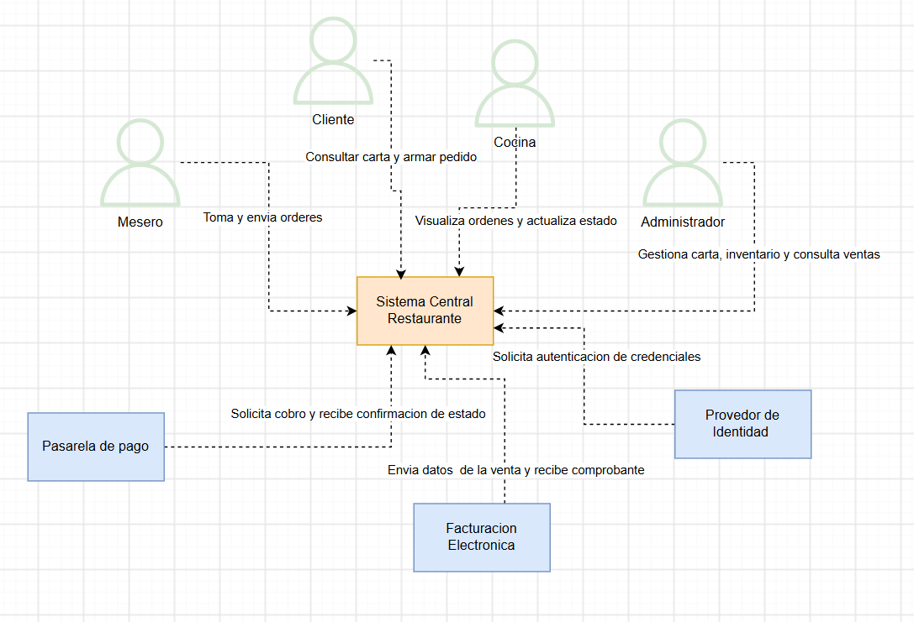

# Definición de Alcance (Scope) - Restaurante Italiano

## 1. Sistema
Plataforma web integral para la digitalización operativa y comercial de un restaurante bajo el concepto italiano. El sistema está diseñado para gestionar un flujo concurrente donde el valor central del negocio es la venta de pastas y pizzas personalizables (con masa, salsas y toppings configurables por el cliente). La plataforma centraliza la experiencia del usuario y la operación interna en un único entorno sincronizado.

## 2. Problema a resolver
Actualmente, el establecimiento opera de manera completamente analógica, lo que genera cuellos de botella en el servicio y pérdida de trazabilidad. Los problemas críticos a resolver son:

*   **Desconexión de inventario y ventas:** No existe una carta digital que se actualice en tiempo real; los clientes piden platos con ingredientes que ya están agotados, generando reprocesos.
*   **Fricción en la toma de pedidos:** El cliente depende 100% de la disponibilidad de un mesero para armar y confirmar su pedido, ralentizando el ciclo de atención.
*   **Falta de sincronización operativa:** El uso de comandas en papel impide que exista visibilidad del estado de los pedidos entre el salón (meseros/clientes) y la cocina.
*   **Aislamiento de datos financieros:** La caja registradora opera de forma independiente, haciendo imposible la generación automatizada de reportes de ventas por plato, por mesero o por franjas horarias.

## 3. Diagrama de Contexto

**Justificación de los elementos del diagrama:**
El modelo sigue el estándar C4 (Nivel 1) para representar el sistema como una caja negra central interactuando con su entorno.

**Actores Externos (Usuarios del sistema):**
*   **Cliente:** Interactúa directamente con el sistema para consultar la disponibilidad de la carta en tiempo real, además de armar y confirmar su pedido de forma autónoma.
*   **Mesero:** Actúa como facilitador en el salón; toma y gestiona órdenes para los clientes que prefieren atención presencial y se encarga de ejecutar el cierre de las cuentas.
*   **Cocina:** Usuario reactivo que gestiona el tablero de preparación, actualizando los estados del pedido (ej. de "RECIBIDO" a "EN PREPARACIÓN") para dar visibilidad al resto del equipo.
*   **Administrador:** Usuario con máximo privilegio operativo encargado de gestionar la carta, crear o desactivar platos, controlar el inventario de ingredientes agotados y consumir los reportes de ventas.

**Sistemas Externos (Integraciones):**
Para mantener un bajo acoplamiento (Low Coupling) y delegar responsabilidades que no pertenecen al núcleo (core) del negocio, el sistema se integra con:
*   **Proveedor de Identidad:** Se delega el registro, autenticación y control de roles de los usuarios a un servicio especializado para garantizar altos estándares de seguridad (Principio de Responsabilidad Única - SRP).
*   **Pasarela de Pago:** Sistema de terceros consumido al momento del cierre de cuenta para procesar transacciones financieras de manera segura.
*   **Facturación Electrónica:** Integración requerida para reportar los datos de venta y emitir los comprobantes legales correspondientes a las entidades fiscales.

## 4. Alcance del Sistema
El alcance técnico y funcional para esta iteración se enmarca estrictamente en el desarrollo de un Producto Mínimo Viable (MVP) para validar el ciclo completo de una orden.

**Dentro del alcance (In-Scope):**
*   Gestión y visualización de una carta digital con control de disponibilidad en tiempo real.
*   Ciclo completo de creación, modificación y confirmación de pedidos (congelando el precio al momento de agregarlo a la cuenta).
*   Manejo de estados en un tablero de cocina interactivo.
*   Proceso unificado de facturación: cierre de cuenta vinculado a una mesa (una cuenta abierta a la vez) y registro de pagos.
*   Implementación de reglas de negocio exclusivas del concepto italiano (límites de toppings, bases obligatorias y control de salsas/proteínas en configuración de platos).
*   Generación de reportes operativos internos.

**Fuera del alcance (Out-of-Scope):**
*   **Módulo de Domicilios y Envíos:** Excluido deliberadamente del MVP; el sistema se limitará al consumo en el local físico hasta validar el flujo interno.
*   **Módulo de Reservas de Mesas:** La gestión de agenda y ocupación futura no forma parte de esta primera versión.
*   **Gestión de Proveedores (ERP):** Aunque se maneja el bloqueo de ingredientes agotados en el sistema, no se desarrollará un módulo para la compra automatizada de insumos a terceros.
*   **Servicio de Notificaciones:** No se implementará el envío de alertas transaccionales (SMS/Push) hacia dispositivos externos de los clientes.
